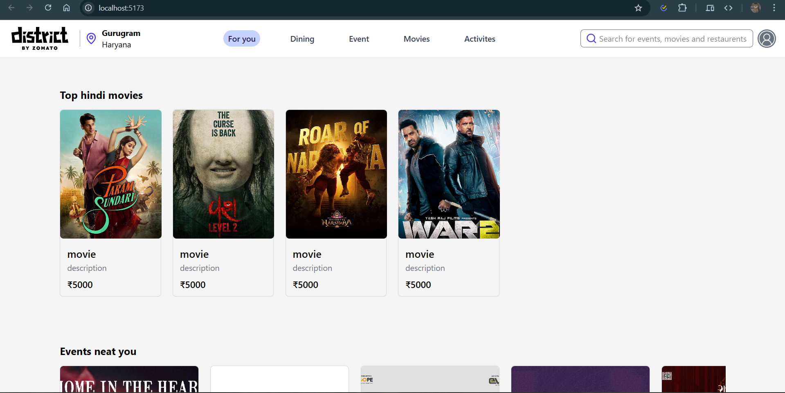

# 🏙️ District by Zomato - UI Clone

A **static React + Tailwind CSS** project that replicates the **District by Zomato** homepage UI.  
This project focuses purely on the **frontend design and responsiveness**, showcasing a clean and modern clone of the original Zomato District interface.

---

## 🚀 Features

- ⚛️ **Built with React** — Component-based and modular.
- 🎨 **Styled using Tailwind CSS** — Clean, responsive, and utility-first styling.
- 🖼️ **UI Clone of District by Zomato** — Replicates the look and layout of the official site.
- 💻 **Static Site** — No backend, APIs, or dynamic data (pure front-end showcase).
- 📱 **Fully Responsive** — Works smoothly on desktops and mobile devices.

---

## 🧩 Tech Stack

| Technology       | Purpose                                                    |
| ---------------- | ---------------------------------------------------------- |
| **React.js**     | UI building and component structure                        |
| **Tailwind CSS** | Styling and layout                                         |
| **Vite / CRA**   | (Depending on your setup) for fast dev server and bundling |

---

## 🛠️ Installation & Setup

1. **Clone the repository**
   ```bash
   git clone https://github.com/yourusername/district-ui-clone.git
   cd district-ui-clone
   ```

2. **Install dependencies**
    ```bash
   npm install
   ```
3. **Run the development server**
    ```bash
   npm run dev
   ```
4. **Open in browser**

```bash
  http://localhost:5173
```

---

## 🖼️ Preview

